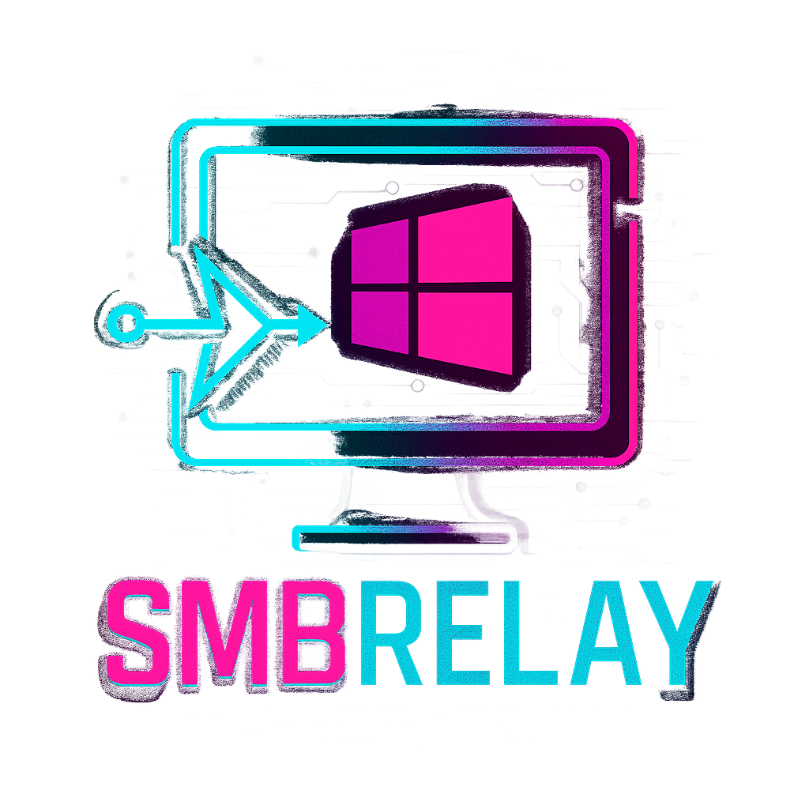
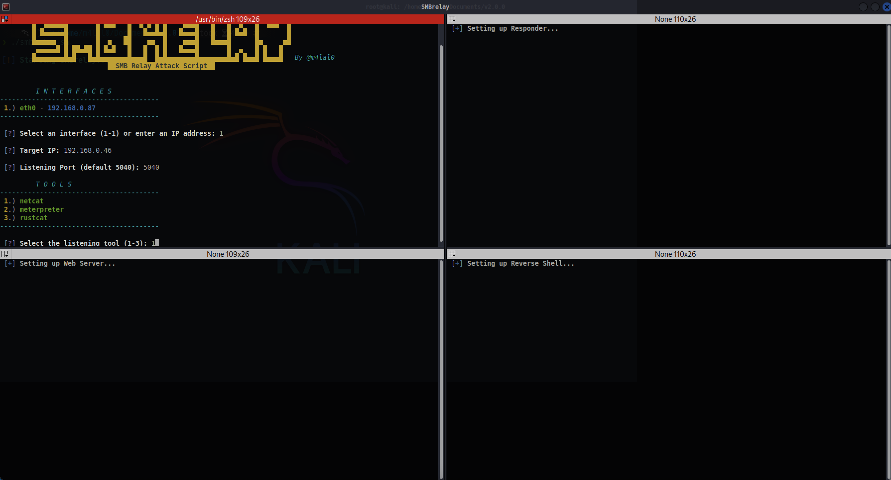
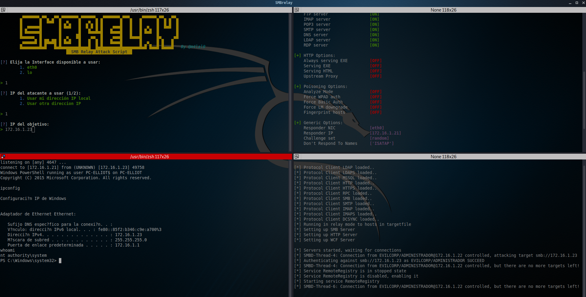

<p align="center"></p>

[](#)
[](#)
[](#)
[](#)
[](#)


# SMB Relay Attack Script
**SMBRelay** es una herramienta de automatización ofensiva diseñada para explotar vulnerabilidades de retransmisión SMB (Server Message Block). Su propósito es interceptar solicitudes de autenticación NTLM y retransmitirlas hacia sistemas vulnerables, con el fin de ejecutar una carga útil y obtener acceso remoto (shell) al sistema comprometido.

Desarrollada pensando en profesionales de la seguridad, SMBRelay está orientada a facilitar y acelerar tareas de pentesting interno, permitiendo simular ataques reales en redes Windows.

> ⚠️ Esta herramienta está destinada exclusivamente a fines educativos y evaluaciones de seguridad autorizadas.

### 🎯 Características principales
+ 🔁 Automatización completa del ataque de NTLM Relay vía SMB.
+ 🧠 Generación y entrega de cargas útiles con Nishang o MSFVenom.
+ 🖥️ Obtención de reverse shell en sistemas Windows con NetCat, RustCat o Meterpreter.
+ 📡 Escucha activa para solicitudes SMB entrantes.
+ 🧪 Herramienta ideal para pruebas internas en entornos reales.

La herramienta fue probada y funciona en Kali Linux.

# Descarga

```bash
git clone https://github.com/m4lal0/smbrelay
cd smbrelay; chmod +x smbrelay.sh
```

# Configuración

Ejecuta la aplicación de la siguiente manera como root:

```bash
./smbrelay.sh --install
```

Realizará la instalación de las dependencias y configurará la terminal Terminator para su uso correcto. El script de instalación funciona con administradores de paquetes apt (Debian).

# ¿Cómo ejecuto la herramienta?

Para ejecutar la herramienta solo es necesario ejecutarlo de la siguiente manera (como root):

```bash
./smbrelay.sh
```



La herramienta ejecutará la terminal Terminator con 4 divisiones.

***Arriba a la izquierda*** : Configuración de parámetros para el uso del ataque SMB Relay.

***Arriba a la derecha*** : Lanzamiento de Responder en la interfaz de red establecida en la configuración.

***Abajo a la izquierda*** : Lanzamiento del payload y ntlmrelayx al equipo victima.

***Abajo a la derecha*** : Lanzamiento de la Reverse Shell o Meterpreter.



## Actualizar la herramienta

Para poder actualizar la herramienta es necesario ejecutarla con el parámetro **--update** ó **-u**, con ello verifica si existe una nueva versión y si la acepta, se iniciará la actualización completa.

```
./smbrelay.sh --update
```