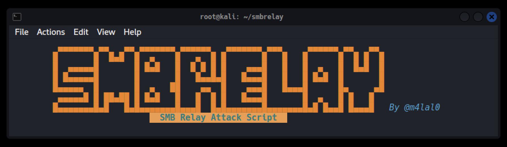

# SMB Relay Attack Script

[](#)
[](#)
[](#)
[](#)
[](#)



**SMBRelay** es un script de ataque de retransmisión SMB, que automatiza todos los pasos para retransmitir la solicitud de autenticación a estos sistemas con el objetivo de obtener un shell. Ideal para realizar pruebas de penetración.

SMBRelay crea y entrega la carga útil aprovechando la herramienta Nishang.

## Instalación

```bash
git clone https://github.com/m4lal0/smbrelay
cd smbrelay; chmod +x smbrelay.sh
./smbrelay.sh --install
```

Al ejecutarlo realizará la instalación de las dependencias y configura la terminal Terminator para su uso correcto. El script de instalación funciona con administradores de paquetes apt (Debian).

## ¿Cómo ejecuto la herramienta?

Para ejecutar la herramienta solo es necesario ejecutarlo de la siguiente manera (como root):

```bash
./smbrelay.sh
```


La herramienta ejecutará la terminal Terminator con 4 divisiones.

***Arriba a la izquierda*** : Configuración de parametros para el uso del ataque SMB Relay.

***Arriba a la derecha*** : Lanzamiento de Responder en la interfaz de red establecida en la configuración.

***Abajo a la izquierda*** : Lanzamiento de la Reverse Shell.

***Abajo a la derecha*** : Lanzamiento del script Nishang al equipo victima.


## Actualizar la herramienta

Para poder actualizar la herramienta es necesario ejecutarla con el parámetro **--update** ó **-u**, con ello verifica si existe una nueva versión y si la acepta, se iniciará la actualización completa.

```
./smbrelay.sh --update
```

## NOTA

Ejecute esta herramienta sólo cuando tenga permiso para hacerlo. Este script es creado para fines educativos o para hacer auditorias profesionales de pentesting a nivel empresarial.